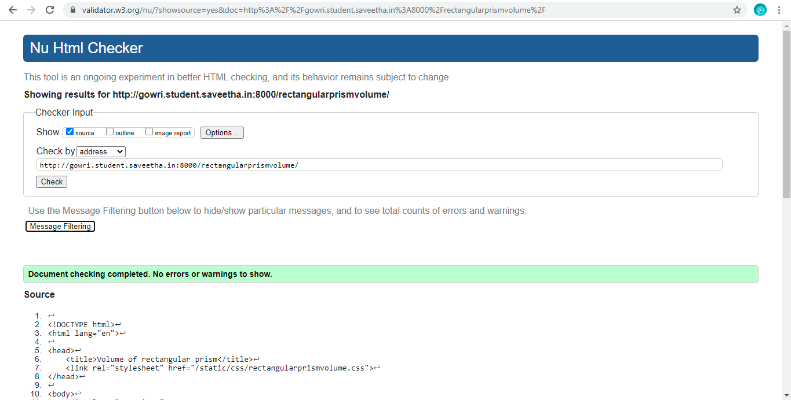

# Mathematical Calculations using JavaScript
## AIM:
To design a website to calculate the  volume of a cylinder and volume of rectangular prism using JavaScript.

## DESIGN STEPS:
### Step 1: 
Requirement collection.
### Step 2:
Creating the layout using HTML and CSS.
### Step 3:
Write JavaScript to perform calculations.
### Step 4:
Choose the appropriate style and color scheme.
### Step 5:
Validate the layout in various browsers.
### Step 6:
Validate the HTML code.
### Step 6:
Publish the website in the given URL.


## PROGRAM:

### mathcylindervolume.html
```

<!DOCTYPE html>
<html lang="en">

<head>
    <title>Cylinder Volume</title>
    <link rel="stylesheet" href="">
</head>

<body>
    <div class="container">
        <div class="formview">
            <div class="banner">
                CYLINDER VOLUME
            </div>
            <div class="content">
                <form action="/mathcylindervolume/" method="GET">
                    
                    <div class="forminput">
                        <label for="value_radius">RADIUS=</label>
                        <input type="text" name="value_radius" id="value_radius">
                    </div>
                    <div  class="forminput">
                        <label for="value_height">HEIGHT=</label>
                        <input type="text" name="value_height" id="value_height">
                    </div>                    
                    <div class="forminput">
                        <button type="button" name="button_volume" id="button_volume">Volume</button>
                    </div>
                    <div  class="forminput">
                        <label for="value_cylindervolume">VALUE=</label>
                        <input type="text" name="value_cylindervolume" id="value_cylindervolume" readonly>
                    </div>  
                </form>
            </div>
        </div>
    </div>
    <script src="/static/js/mathcylindervolume.js"></script>
</body>

</html>
```
### mathcylindervolume.css
```
*{
      box-sizing: border-box;
      font-family: Arial, Helvetica, sans-serif;
      color: rgb(231, 185, 35);
}

body, html{
    margin-top: 0px;
    margin-right: 0px;
    margin-bottom: 0px;
    margin-left: 0px;
    padding-top: 0px;
    padding-right: 0px;
    padding-bottom: 20px;
    padding-left: 0px;
    background-color: rgb(231, 185, 35);
}

.container{
    width: 750px;
    margin-left: auto;
    margin-right: auto;
}

.formview{
    justify-content: center;
    margin-top: 100px; 
}

.forminput{
    height: 50px;
    padding-top: 20px;
    font-size: larger;
}

.banner{
    display: block;
    width: 100%;
    background-color: rgb(5, 5, 5);
    padding-top: 20px;
    text-align: center;
    height: 60px;
}

.content{
    display: block;
    width: 100%;
    background-color: rgb(34, 33, 37);
    text-align: center;
}

input{
    color: rgb(12, 11, 11);
}
button{
    color: rgb(199, 29, 29);
}
```

### mathcylindervolume.js
```
volumeBtn = document.querySelector('#button_volume');

volumeBtn.addEventListener('click',function(e){
    
    txtRadius = document.querySelector('#value_radius');
    txtHeight = document.querySelector('#value_height');
    txtCylindervolume = document.querySelector('#value_cylindervolume');

    let cylindervolume;

    cylindervolume = parseFloat(txtRadius.value) * parseFloat(txtHeight.value);

    txtCylindervolume.value = cylindervolume;
});
```

### rectangularprismvolume.html
```

<!DOCTYPE html>
<html lang="en">

<head>
    <title>Volume of rectangular prism</title>
    <link rel="stylesheet" href="">
</head>

<body>
    <div class="container">
        <div class="formview">
            <div class="banner">
                RECTANGULAR PRISM VOLUME
            </div>
            <div class="content">
                <form action="/rectangularprismvolume/" method="GET">
                    
                    <div class="forminput">
                        <label for="value_length">LENGTH=</label>
                        <input type="text" name="value_length" id="value_length">
                    </div>
                    <div  class="forminput">
                        <label for="value_width">WIDTH=</label>
                        <input type="text" name="value_width" id="value_width">
                    </div>
                    <div  class="forminput">
                        <label for="value_height">HEIGHT=</label>
                        <input type="text" name="value_height" id="value_height">
                    </div>                    
                    <div class="forminput">
                        <button type="button" name="button_volume" id="button_volume">Volume</button>
                    </div>
                    <div  class="forminput">
                        <label for="value_rectanglevolume">VALUE=</label>
                        <input type="text" name="value_rectanglevolume" id="value_rectanglevolume" readonly>
                    </div>  
                </form>
            </div>
        </div>
    </div>
    <script src="/static/js/rectangularprismvolume.js"></script>
</body>

</html>
```

### rectangularprismvolume.css
```
*{
      box-sizing: border-box;
      font-family: Arial, Helvetica, sans-serif;
      color: rgb(78, 240, 240);
}

body, html{
    margin-top: 0px;
    margin-right: 0px;
    margin-bottom: 0px;
    margin-left: 0px;
    padding-top: 0px;
    padding-right: 0px;
    padding-bottom: 20px;
    padding-left: 0px;
    background-color: rgb(78, 240, 240);
}

.container{
    width: 750px;
    margin-left: auto;
    margin-right: auto;
}

.formview{
    justify-content: center;
    margin-top: 100px; 
}

.forminput{
    height: 50px;
    padding-top: 20px;
    font-size: larger;
}

.banner{
    display: block;
    width: 100%;
    background-color: #e94b3cff;
    padding-top: 20px;
    text-align: center;
    height: 60px;
}

.content{
    display: block;
    width: 100%;
    background-color: rgb(228, 124, 115);
    text-align: center;
}

input{
    color: rgb(12, 11, 11);
}
button{
    color: rgb(29, 55, 199);
}
```

### rectangularprismvolume.js
```
volBtn = document.querySelector('#button_volume');

volBtn.addEventListener('click',function(e){
    
    txtLength = document.querySelector('#value_length');
    txtWidth = document.querySelector('#value_width');
    txtHeight = document.querySelector('#value_height');
    txtRectvolume = document.querySelector('#value_rectanglevolume');

    let rectanglevolume;

    rectanglevolume = parseFloat(txtLength.value) * parseFloat(txtWidth.value) * parseFloat(txtHeight.value);

    txtRectvolume.value = rectanglevolume;
});
```

## OUTPUT:


## CODE VALIDATION REPORT:




## RESULT:
 Thus a websites is designed to calculate the  volume of a cylinder and volume of rectangular prism using JavaScript and is hosted in the URLs  http://gowri.student.saveetha.in:8000/mathcylindervolume , http://gowri.student.saveetha.in:8000/rectangularprismvolume and the HTML codes is validated.